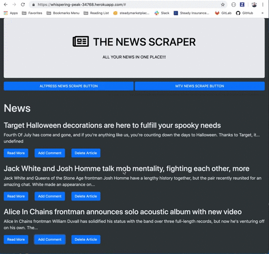
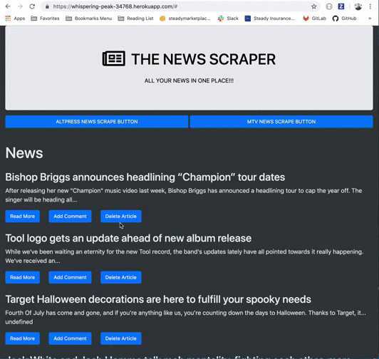
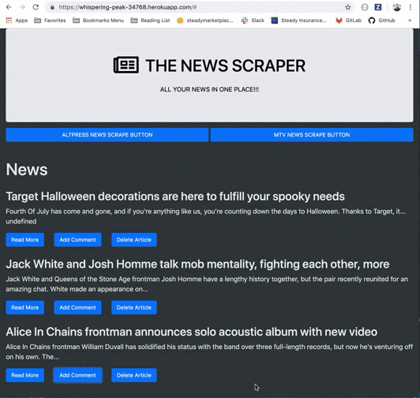

# THE NEWSCRAPER

"THE NEWSCRAPER" can scrape news from different websites, add comments to each article, update or delete comments as well as delete your articles. You don't need to waste your time searching for news in different sites because "THE NEWSCRAPER" does that for you! To check out our demo website [Click here](https://whispering-peak-34768.herokuapp.com/#).

## See the app in action.

1. SCRAPE MTV & ALTPRESS.

2. DELETE ANY ARTICLE.

3. SAVE COMMENTS TO EACH ARTICLE.

4. CREATE & UPDATE YOUR COMMENTS.

5. DELETE YOUR COMMENTS.

## Built With

* express
* express-handlebars
* mongoose
* cheerio
* axios
